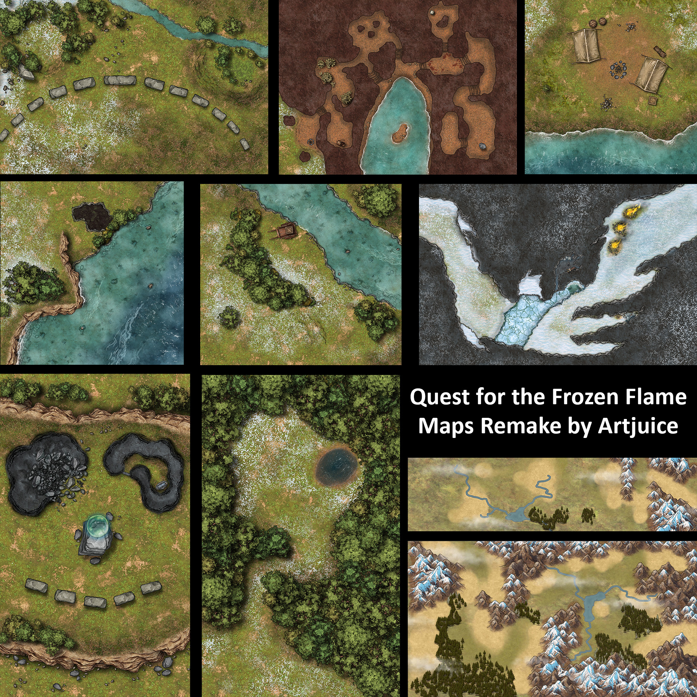

# Quest for the Frozen Flame Maps - Book 1

A FoundryVTT module containing maps for Pathfinder 2E's Quest for the Frozen Flame Adventure Path. Built based on [this module](https://gitlab.com/artjuice-maps/qftff-maps-remake) by artjuice-maps, updated for version 14 of FoundryVTT.

---

All maps are designed for [FoundryVTT](https://foundryvtt.com/), with the walls already set up. The Gleaming Sun Lake map includes an already set-up tile to hide the cave.

The module does not contain any of the material or content from the book. You will need to purchase your own copy to play it. You should support Paizo and this adventure path by [purchasing the books](https://paizo.com/store/pathfinder/adventures/adventurePath/questForTheFrozenFlame).

These maps can be also be downloaded for free from [Google Drive](https://drive.google.com/drive/folders/1UcSYgKzcfm9APD4V2rkmXmQHu7ENFtDS?usp=sharing), where you can use them without installing this module.

# Credit

FORGOTTEN ADVENTURES - A couple of the maps use assets from [Forgotten Adventures](https://www.forgotten-adventures.net/info/).

INKARNATE - All of the maps were created in [Inkarnate Pro](https://inkarnate.com/) using their assets.

# Installation

Once you have installed and activated the module, the scenes will appear as compendium in your game. Import that to have the scenes all ready to go.

```
https://github.com/mikantlin/qftff-bk1-foundry-maps/raw/master/module.json
```

[](https://github.com/mikantlin/qftff-bk1-foundry-maps/raw/master/preview/qftff1-preview.jpg)
